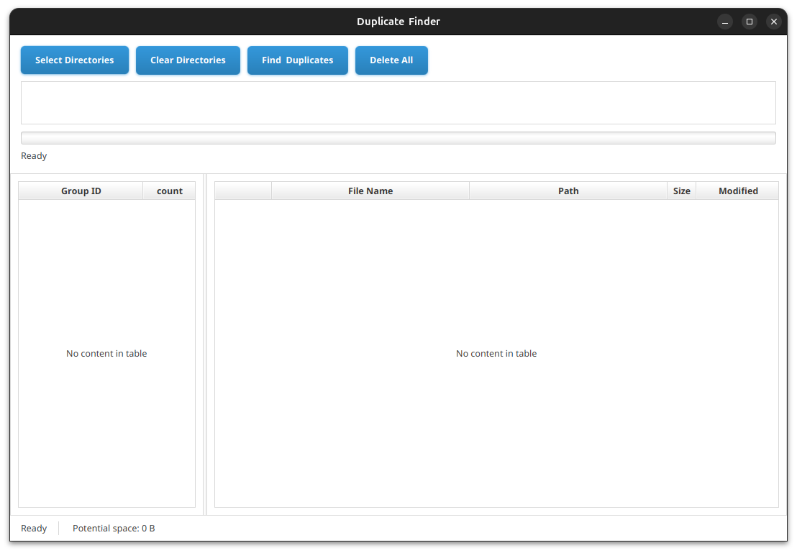
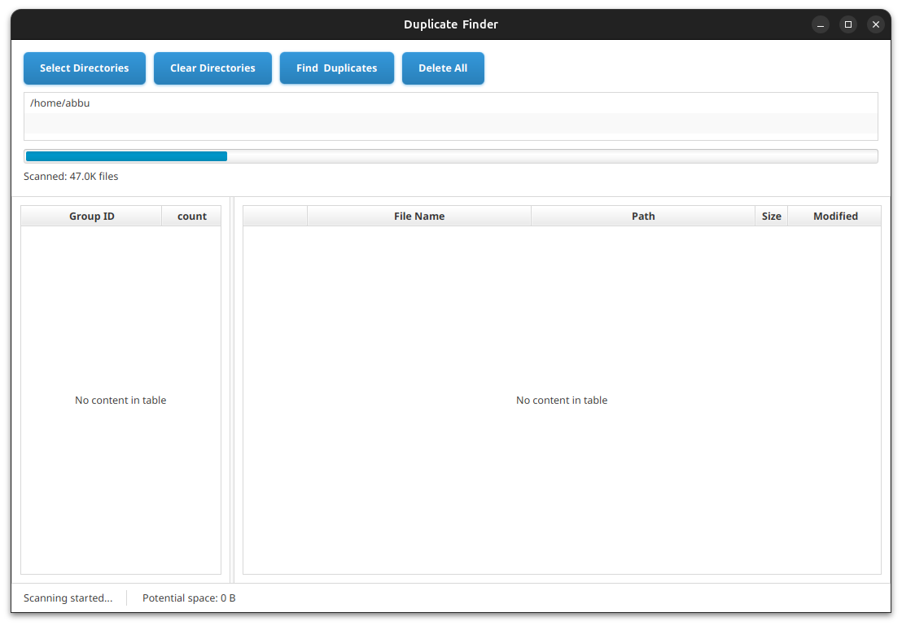
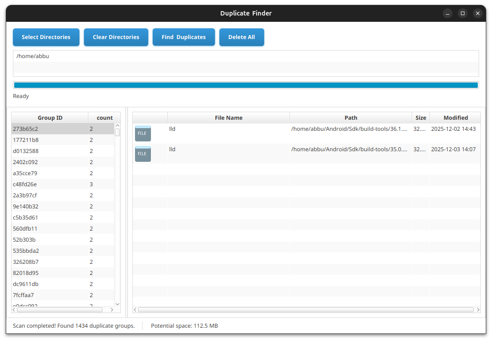

# JavaFX Duplicate File Finder


A desktop application to find and manage duplicate files using JavaFX with a modern UI.

## ✨ Features
- **Smart Scanning**: First compares file sizes, then MD5/SHA-1 hashes for accuracy
- **Multi-threaded**: Uses JavaFX `Task` for background scanning with progress tracking
- **Visual Preview**: Thumbnail generation and file icons
- **Intuitive UI**: 
  - Dual-table interface (groups + files)
  - Real-time progress bar
  - Batch operations
- **Performance**: Utilizes Java NIO `Files` API for efficient file operations

## 📸 Screenshots

### Main Interface

*Main application window showing duplicate groups*

### Scanning Progress

*Real-time progress during file scanning*

### Results View

*Detailed view of duplicate files with previews*

## 🚀 Getting Started

### Prerequisites
- Java 17 or higher
- JavaFX 20 or higher
- Maven/Gradle

### Installation
```bash
# Clone the repository
git clone https://github.com/YOUR_USERNAME/javafx-duplicate-finder.git

# Navigate to project
cd javafx-duplicate-finder

# Build and run
mvn clean javafx:run
# OR
./gradlew run
